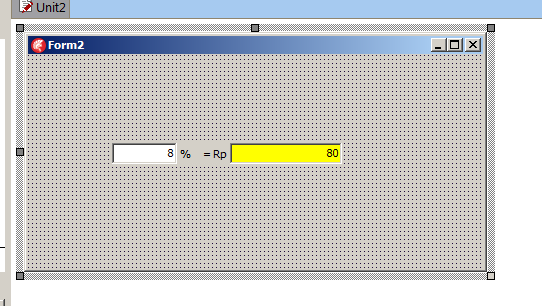
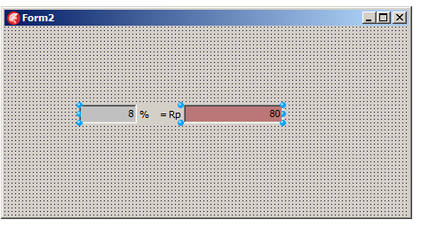

# TPersen
Komponen  untuk menampilkan hasil perhitungan persentase.

Telah dites pada Delphi XE8.

## Kegunaan
Mendukung perhitungan persentase. Hitungan persentase sangat sederhan, namun ketika harus menerima input dan menampilkan kembali 
ke UI akan merepotkan, terutama jika perhitungan ini menggunakan beberapa step yang kompleks.

## Screenshots

## Properties
- NilaiDasar: nilai dasar, contoh 1000
- Persen: persentase, contoh 5
- Nilai: hasil perhitungan, contoh 5% dari 1000 = 50

## Events
Gunakan event onChange. Event ini di-fire jika ada salah satu property di atas yang berubah.

## Instalasi
Seperti biasa: tambahkan folder ke library path, open package, build dan install.
